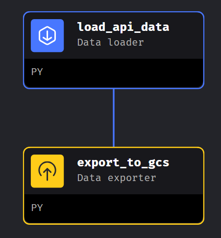
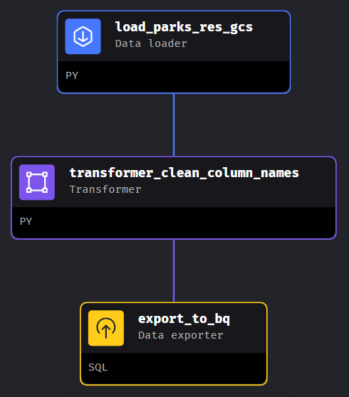
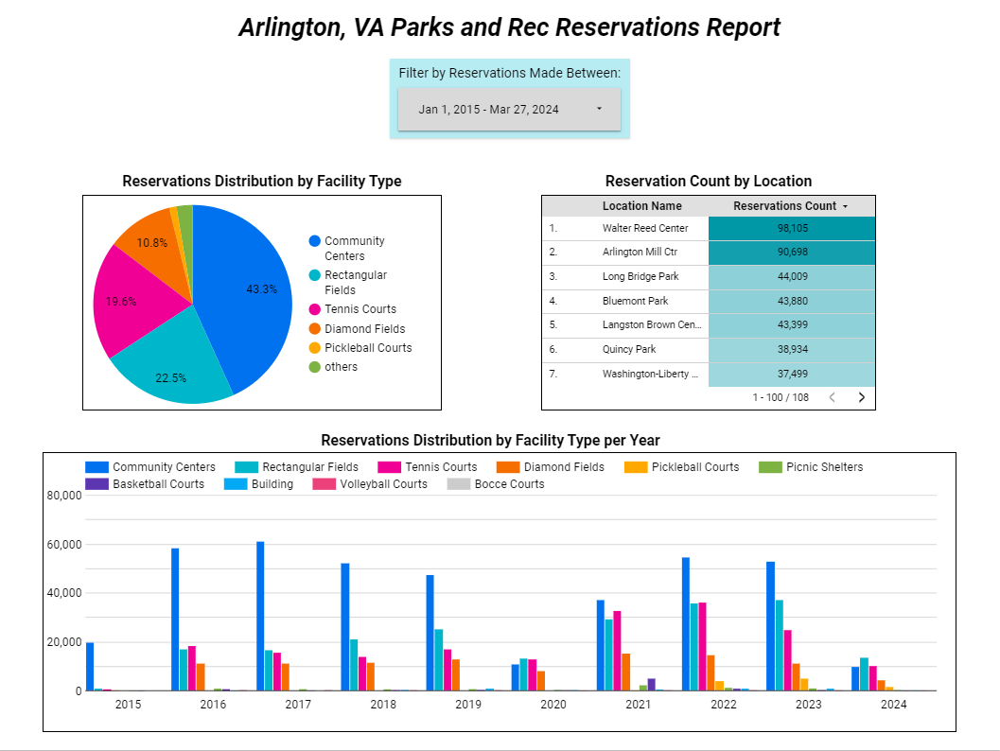

# Arlington County Parks and Rec Reservations Analysis

This is my final project for the [Data Engineering Zoomcamp course](https://github.com/DataTalksClub/data-engineering-zoomcamp) by DataTalksClub. I built a batch data pipeline that extracts, transforms and loads the [Arlington, Virginia Dept of Parks and Recreation Facility Reservations](https://data.arlingtonva.us/dataset/74) dataset into a data warehouse in  [Google Cloud Platform (GCP)](https://cloud.google.com/). Further transformations are done on the data using [dbt](https://www.getdbt.com/) (data build tool) for preparation of a dashboard.

For the steps of how to reproduce this project, see [recreate-project.md](recreate_project.md).

## Project description

The Arlington Dept of Parks and Recreation manages park, tennis court, rectangular field, picnic shelter, diamond field, community center and other facility reservations. The reservations dataset includes detailed reservation information for each facility. The department would like to analyze this data to understand which spaces are being reserved/utilized the most for each type of facility that they manange. This project aims to develop an streamlined end-to-end data pipeline to transform the dataset into a dashboard that is more suitable for querying and analysis to allow the department to make more informed decisions regarding changing their facilities to better suit the communityu's needs.

This project has the goal of answering the following questions:

1. What is the distribution of reservations broken down by faciltiy type for the entire dataset (records are from 2015-present)?

2. Which locations have been reserved the most? 

3. What is the distribution of reservations broken down by faciltiy type per year?

### Technologies

* [Mage](https://docs.mage.ai/introduction/overview) for pipeline development and workflow orchestration.

* [Terraform](https://www.terraform.io/) for managing and provisioning infrastructure (GCS bucket abd BigQuery dataset) in GCP.

* [Docker](https://www.docker.com/) for encapsulating the dataflows and their dependencies into containers, making it easier to deploy them.

* [Data Build Tool (dbt)](https://www.getdbt.com/) for transforming and partitioning the dataset in the data warehouse.

* [Google Cloud Storage](https://cloud.google.com/storage) for storing the dataset.

* [Google Bigquery](https://cloud.google.com/bigquery) for performing SQL analytical queries and data transformations defined in dbt.

* [Google Looker Studio](https://lookerstudio.google.com/) for creating a dashboard to visualize the dataset.

## Project architecture

### How the data pipeline works

* Mage pipelines:

    1. API to GCS

        
        
        -  [load_api_data.py](./mage/arl-parks-reservations-mage/data_loaders/load_api_data.py) pulls data from the Arlington Parks and Rec Open Data API and specifies data types for each column.
        -  [export_to_gcs.py](./mage/arl-parks-reservations-mage/data_exporters/export_to_gcs.py) loads the data into a bucket in Google Cloud Storage (GCS) as a parquet file.

    2. GCS to BigQuery 

        
        
        -  [load_parks_res_gcs.py](./mage/arl-parks-reservations-mage/data_loaders/load_parks_res_gcs.py) loads the data from the parquet file in the bucket.
        -  [transformer_clean_column_names.py](./mage/arl-parks-reservations-mage/transformers/transformer_clean_column_names.py) cleans the column names by lowercasing capital letter and putting underscores between words.
        -  [export_to_bq.sql](./mage/arl-parks-reservations-mage/data_exporters/export_to_bq.sql) loads the data from the parquet file in the bucket.

* dbt models:

    1. [stg_arl_parks_data](./dbt/arl-parks-reservations/models/staging/stg_arl_parks_data.sql): selects a subset of columns from the raw table that was loaded into BigQuery.

    2. [dim_facility_types](./dbt/arl-parks-reservations/models/core/dim_facility_types.sql): selects all data from a seed CSV file that tranlates the facility type codes into more understandable text.  
    
    3. [fact_reservations](./dbt/arl-parks-reservations/models/core/fact_reservations.sql): selects all data from stg_arl_parks_data and partitions it by day. Partitioning makes it more efficient to query the data and present it on the dashboard. 

## Results

The dashboard is publicly available in this [link](https://lookerstudio.google.com/s/o_KRHFslJWk).

### Key findings

* Facility types reserved the most from 2015-present:

    1. Community Centers (43.3%)
    2. Rectangular Fields (22.5%)
    3. Tennis Courts (19.6%)
    4. Diamond Fields (10.8%)

* The most reserved location is Walter Reed Community Center with 98,055 reservations from 2015-present and the least is Thrifton Hills Park with 56.

* Reservations for Rectangular Fields have risen between 2015-2023 with a dip in 2020 due to the pandemic indicating increased use by the community.

* Reservations for Pickleball Courts have dramatically increased in the last 2 years indicating rising popularity in the sport which may see increased demand for more courts in the future.

