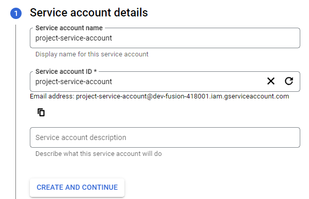
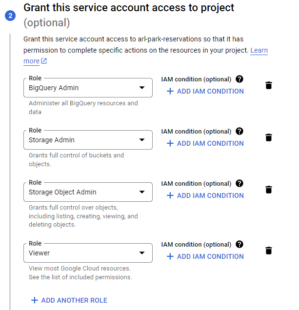
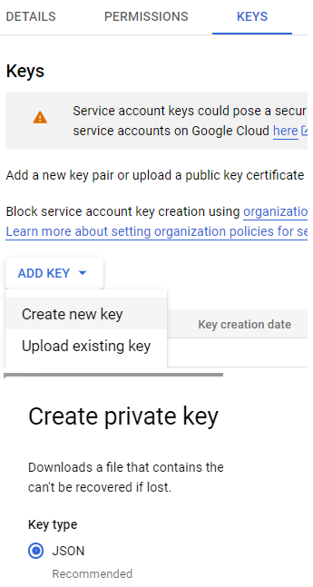
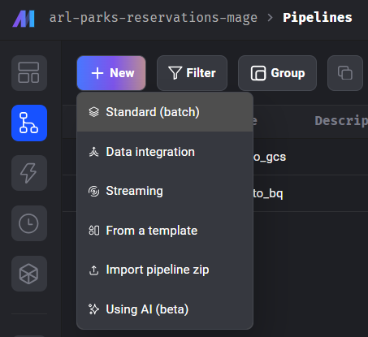
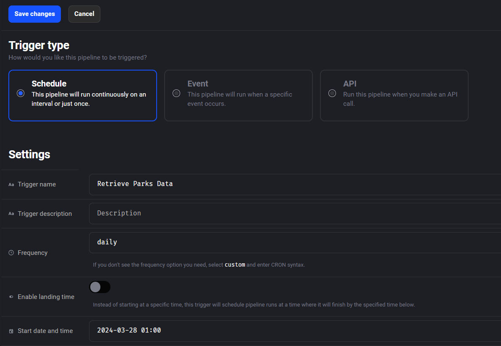
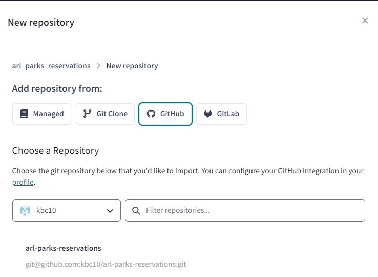
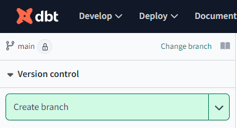
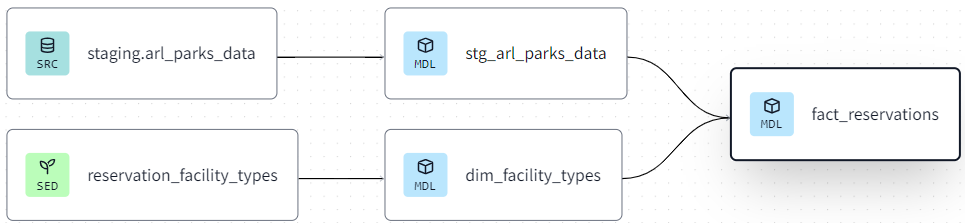
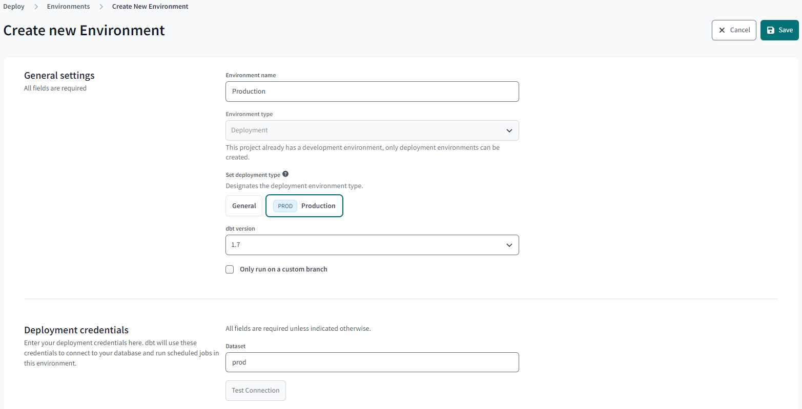
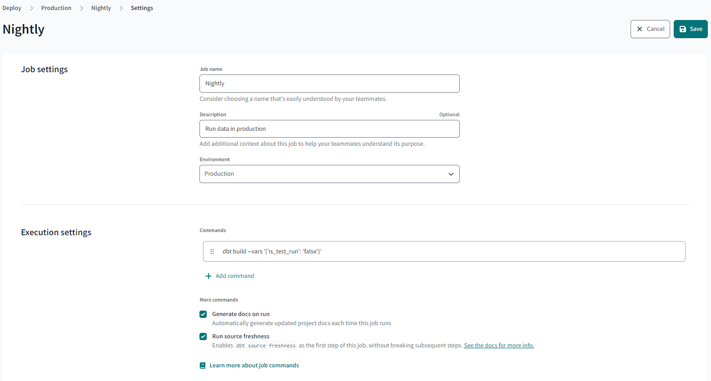

## How to Recreate This Project

### Set up GCP
1. Create a [GCP account](https://cloud.google.com/?hl=en). You can do a free trial with $300 worth of free credits.
2. Create a new project and note your project ID.
3. Create a GCP service account. From the sidebar, go to "IAM & Admin" -> "Service Accounts" -> "Create Service Account".
    > Note: Grant "BigQuery Admin", "Storage Admin" and "Storage Object Admin" permissions to our service account. In real life, we would not grant such wide permissions to this account, but these should work for the purposes of this project.

    

    

4. Generate service-account-keys (.json) for authentication. Terraform and dbt will use this key to integrate with GCS and BigQuery. Under your service account, go to the "Keys" tab, then click on "Add Key" -> "Create New Key" -> "JSON" -> "Create". A JSON source file will be downloaded. Add this file to your project directory.

    

### Set up Terraform
1. Install [Terraform](https://developer.hashicorp.com/terraform/install?ajs_aid=268d2cbe-21f8-4c6c-9588-849c28f1444b&product_intent=terraform) if you have't already done so.
2. Create a new folder in your project directory called `terraform` and create a `main.tf` file like [this](./terraform/main.tf).
    > Note: You can also create `variables.tf` to store your varibales like [this](./terraform/variables.tf).
3. Initialize terraform and install any required plugins and settings.
    ```
    cd terraform
    terraform init
    ```
4. Run `terraform plan` to see how terraform will create or modify our infrastructure (i.e. our GCS bucket and BigQUery dataset).
5. Apply the plan with `terraform apply`.
6. Check your GCP project to see that a bucket and dataset have been created.

### Set up Mage
1. The [Mage quickstart repo](https://github.com/mage-ai/compose-quickstart) provides a template for users to have an easy way to deploy a project using Docker. 
2. Run the following commands to copy the quickstart repo to your directory and start running the Mage Docker container.
    ```
    git clone https://github.com/mage-ai/compose-quickstart.git mage-quickstart \
    && cd mage-quickstart \
    && cp dev.env .env && rm dev.env
    ```
3. Edit `.env` file in the `mage-quickstart` directory and name your project with the `PROJECT_NAME` variable.
4. Run `docker compose up` in the terminal to start the Mage docker container.
5. Navigate to and edit the `io_config.yaml` file in your new project's directory under the `mage-quickstart` directory to change the Google section to the following:
    ```
    # Google
      GOOGLE_SERVICE_ACC_KEY_FILEPATH: "/home/src/your-private-key.json"
      GOOGLE_LOCATION: US # Optional
    ```
6. Open http://localhost:6789 in your browser to start developing pipelines.
7. Create a standard (batch) pipeline to load the dataset from the API and to move it into a GCS bucket as a parquet file. 

    

    * [load_api_data.py](./mage/arl-parks-reservations-mage/data_loaders/load_api_data.py) is used as a data loader block. 
    * [export_to_gcs.py](./mage/arl-parks-reservations-mage/data_exporters/export_to_gcs.py) is used as a data exporter block
8. Create a standard (batch)pipeline to load the parquet file from GCS into BigQuery
    * [load_parks_res_gcs.py](./mage/arl-parks-reservations-mage/data_loaders/load_parks_res_gcs.py) is used as a data loader block.
    * [transformer_clean_column_names.py](./mage/arl-parks-reservations-mage/transformers/transformer_clean_column_names.py) is used as a transformer block
    * [export_to_bq.sql](./mage/arl-parks-reservations-mage/data_exporters/export_to_bq.sql) is used as a data exporter block.
9. OPTIONAL: The dataset gets updated daily. You can create triggers for these pipelines to run daily to update GCS and BigQuery with the most recent data.

    

### Set up dbt
1. I used dbt cloud for this project. Create a project called "arl_parks_reervations".
2. Connect the project to your git project repository clicking on the settings wheel -> "Account Settings" -> "Projects" -> "Your Project".

    

3. Connect the project to BigQuery by providing your Google service-account-keys (.json) file.
4. Click on the "Develop" tab -> "Cloud IDE" and create a new branch to start developing models.

    

5. Add the following models under the staging and core models:
    * staging
        1. [stg_arl_parks_data](./dbt/arl-parks-reservationsmodels/staging/stg_arl_parks_data.sql): selects a subset of columns from the raw table that was loaded into BigQuery.
    * core
        1. [dim_facility_types](./dbt/arl-parks-reservations/models/core/dim_facility_types.sql): selects all data from a seed CSV file that tranlates the facility type codes into more understandable text.  
        
        3. [fact_reservations](./dbt/arl-parks-reservations/models/core/fact_reservations.sql): selects a subset of columns from stg_arl_parks_data and partitions it by day. Here, the partitioning makes it more efficient to query the data and present it on the dashboard. 
6. The project lineage graph should look like this.

7. Run `dbt build` in the command line of the IDE to start building the fact and dimension tables in BigQuery.
    > Note: Running `dbt build` will only add 100 rows to the tables since the variable `is_test_run` is default set to True. Run 
    ```dbt build --select --vars '{'is_test_run': 'false'}'``` to build the fact and dimension tables using the entire dataset.
8. To deploy this project, you must create a production environment. Click on "Deploy" -> "Environments" -> "Create Environment". Enter in the environment details as below. 

    

9. Go to your newly made Production environment and click on "Create Job" -> "Deploy Job". Edit the job to have a name and enter the job details as below.
    > Note: You can optionally have the job run on a schedule the build the data models with new data. This would be daily since the reservations dataset is updated daily. 

    
